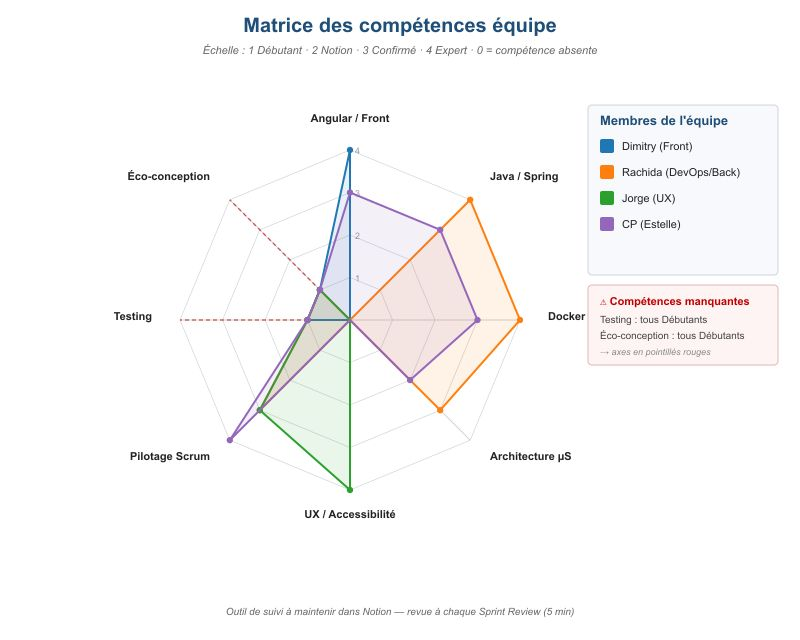

# COPROJ
## Évolution d'application

*Instance du 08/05/2026*

---
## Sommaire
 
1. [Objectif du projet](#objectif-du-projet)
2. [Équipe](#équipe)
3. [Indicateurs de réussite du projet](#indicateurs-de-réussite-du-projet)
4. [Planification des sprints](#planification-des-sprints)
5. [Sprint en cours](#sprint-en-cours)
6. [Suivis des points bloquants](#suivis-des-points-bloquants)
7. [Definition of Done évolutive](#definition-of-done-évolutive)
8. [Risques du projet](#risques-du-projet)
9. [Identifier les partenaires](#identifier-les-partenaires)
10. [Prise en compte sociale & humaine (PSH)](#prise-en-compte-sociale--humaine-psh)
11. [Conduite du changement](#conduite-du-changement)
12. [Identification des besoins en formation](#identification-des-besoins-en-formation)
13. [Formations à prévoir](#formations-à-prévoir)
---

## Objectif du projet

### Contexte

Catasterre est une application web de visualisation de catastrophes naturelles à partir de données satellites, utilisée par des notaires et agences immobilières pour évaluer les risques d'un bien.

### Objectifs produit

| # | Objectif | Traduction projet |
|---|----------|-------------------|
| 1 | Améliorer l'UX | Corriger style CSS, messages d'erreur, accessibilité |
| 2 | Disponibilité, maintenabilité, évolutivité | Docker → micro-services |
| 3 | Fiabiliser l'organisation du développement | Pipeline CI/CD + environnement de test |

---

## Équipe

| Membre | Rôle | Expertise |
|--------|------|-----------|
| **Estelle** | Expert dev / Chef de projet | Pilotage agile + dev |
| **Dimitry** | Développeur Front-end (3 ans) | Angular, RxJS |
| **Rachida** | Développeuse back / DevOps (5 ans) | Java/Spring, Docker, K8s, CI |
| **Jorge** | UX Designer (12 ans) | Figma, wireframes, A11Y |

---

## Indicateurs de réussite du projet

| KPI | Cible | Dimension | Outil de mesure |
|-----|-------|-----------|------------------|
| Score Lighthouse A11Y | **≥ 95 / 100** | UX / Accessibilité | Lighthouse |
| Couverture de tests | **≥ 70 % back / ≥ 50 % front** | Qualité | JaCoCo / Istanbul |
| Uptime de l'application | **≥ 99.5 %** | Disponibilité | Monitoring serveur |
| Vélocité moyenne de l'équipe | **15 pts / sprint** | Pilotage équipe | Outil de gestion backlog |
| Durée de la pipeline CI | **< 10 minutes** | Processus DevOps | Logs GitHub Actions |
| Éco-score EcoIndex | **≥ B (≥ 70 / 100)** | Éco-conception | EcoIndex / ecoindex-cli |

---

## Planification des sprints

| Sprint | Epic principal | User Stories | Pts | Objectif de sprint |
|--------|----------------|--------------|-----|---------------------|
| **S1** | UX + Architecture | US1 + US2 + US5 | 13 | Fondations UX & conteneurisation |
| **S2** | UX + Qualité | US3 + US7 | 13 | Accessibilité & automatisation |
| **S3** | Qualité + UX + Spike | US8 + US10 + US12 | 14 | Qualité & cadrage architecture |
| **S4** | Architecture | US6 | 10 | Migration microservices |
| **S5** | UX + Métier | US4 + US9 | 13 | UX enrichie & fiabilité métier |
| **S6** | Métier | US11 | 5 | Livraison des exports PDF/CSV |

---

## Sprint en cours

### Sprint 1

| US | Pts | Statut | Owner | Commentaire |
|----|-----|--------|-------|-------------|
| US1 - Style CSS | 5 | 🟢 **En cours** | Dimitry | Audit terminé, refonte variables en cours |
| US2 - Messages d'erreur | 3 | 🟢 **En cours** | Dimitry + Rachida | Inventaire terminé, implémentation démarrée |
| US5 - Docker | 5 | 🟠 **À démarrer** | Rachida | Prévu mi-sprint |

---

## Suivis des points bloquants

### 🚨 Point bloquant remonté en Daily Scrum (Rachida)

> *« Nous ne pouvons pas développer et tester en même temps. Le reste de l'équipe n'a pas les compétences nécessaires pour écrire et implémenter des tests. »*

**Impact :** la qualité de l'incrément ne peut pas être validée → **risque critique sur tout le projet**.

### ✅ Actions correctives engagées

- **Ajustement Sprint Backlog** : plan de tests sorti du Sprint 1 pour ne pas bloquer la livraison
- **Plan de formation testing** lancé en parallèle hors sprint
- **Binômes** sur les premiers tests pilotes dès la fin du Sprint 1
- **Documentation du risque R2** dans la matrice et suivi dédié

---

## Definition of Done évolutive

### Sprint 1 - DoD minimale
- Revue de code obligatoire
- Tests manuels documentés sur les chemins critiques
- Déploiement réussi

### Sprint 2 - DoD transitoire
- Tous les critères du Sprint 1
- Premiers tests unitaires rédigés en binôme sur 1 US pilote, exécutés en local
- Couverture pas encore mesurée automatiquement

### Sprints 3 à 6 - DoD cible
- Tests unitaires sur le nouveau code, exécutés via la CI (US7)
- Couverture sur le nouveau code ≥ 70 % back / ≥ 50 % front, mesurée par SonarCloud à chaque PR
- Tests d'intégration sur les US critiques
- Tests E2E Cypress sur les parcours critiques à partir du Sprint 4

---

## Risques du projet

| # | Risque | Proba | Impact | Criticité | Mitigation |
|---|--------|-------|--------|-----------|------------|
| **R1** | Vélocité réelle < 15 pts/sprint | Forte | Moyen | 🔴 **Critique** | Recalibrer après S1, ajuster périmètre |
| **R2** | Manque de compétences en testing | Forte | Fort | 🔴 **Critique** | Plan de formation + binômes |
| **R3** | Bus factor sur Rachida | Faible | Fort | 🟠 **Modéré** | Documentation + binômes transverse |
| **R4** | Surcharge du chef de projet | Forte | Moyen | 🟠 **Modéré** | Déléguer le dev, prioriser le pilotage |
| **R5** | Micro-services sous-estimé | Moyenne | Fort | 🔴 **Critique** | Spike préalable au Sprint 3 |
| **R6** | Régressions en production (pas d'env. test) | Forte | Fort | 🔴 **Critique** | US7 + US8 en priorité |
| **R7** | Indisponibilité sources de données externes | Faible | Moyen | 🟡 **Faible** | Cache + mode dégradé, sources officielles |
| **R8** | Sécurité du projet (vulnérabilités applicatives, fuite de données clients, dépendances obsolètes, secrets exposés) | Moyenne | Fort | 🔴 **Critique** | Analyse de faille intégrée à la CI (US7), audit des dépendances (npm audit, Dependabot), gestion des secrets via variables d'environnement, revue de code systématique, conformité OWASP Top 10 |
| **R9** | Dépassement du temps de développement estimé (charges sous-évaluées, imprévus techniques, congés/maladies) | Moyenne | Fort | 🔴 **Critique** | Suivi du burndown et de la vélocité à chaque sprint, revue d'estimation en Sprint Review, marge de sécurité sur les US complexes (US6, US9) |

### Matrice Probabilité × Impact

|  | Impact Faible | Impact Moyen | Impact Fort |
|---|---|---|---|
| **Probabilité Forte** | — | 🟠 R1, R4 | 🔴 R6 |
| **Probabilité Moyenne** | — | — | 🔴 R2, R5, R8, R9 |
| **Probabilité Faible** | — | 🟡 R7 | 🟠 R3 |

**Légende**
- 🔴 **Critique** - action immédiate requise
- 🟠 **Modéré** - à surveiller
- 🟡 **Faible** - acceptable

---

## Identifier les partenaires

| Partenaire type | Besoin adressé | Rôle proposé | Coordination |
|------------------|----------------|--------------|--------------|
| Cabinet d'audit A11Y | Audit accessibilité | Audit avant US3 | Mission cadrée Sprint 2, rapport + plan conformité |
| Hébergeur bas carbone (ex. OVHcloud) | Infrastructure cloud sobre | Fournisseur infra | Étude comparative dans le spike US6 |
| Consultant architecture micro-services | Cadrage technique avant US6 | Expert ponctuel, co-animation du spike | 1 à 2 jours de consulting lors du Sprint 3 |
| Éditeur monitoring (ex. Grafana Cloud) | Observabilité production + CI | Intégration pipeline + dashboards | Souscription mensuelle, intégration par Rachida |

---

## Prise en compte sociale & humaine (PSH)

| Axe | Action concrète |
|-----|------------------|
| **Montée en compétences** | Plan de formation testing hors sprint, Mentorat interne croisé |
| **Équilibre de la charge** | Bus factor surveillé sur Rachida → Binômes systématique sur le chemin critique |
| **Écoute active** | Blocage Rachida traité immédiatement → Ajustement Sprint du Backlog |

- **Revue de formation** à chaque fin de sprint
- **Indicateur dédié** : % modules de formation complétés / membre
- **Ajustement à la rétro** suivante en cas de difficulté remontée

---

## Conduite du changement

### Anticipation des freins humains

| Frein | Comment on l'adresse |
|-------|----------------------|
| Résistance au changement | Explication du « pourquoi » avant chaque pratique nouvelle |
| Courbe d'apprentissage | Premiers tests pilotes en binômes (jamais seul face à la difficulté) |
| Sentiment de surcharge | Formation hors sprint, pas d'objectif de couverture irréaliste |

### Pratiques à ancrer durablement

| Pratique | Ancrage | Fréquence |
|----------|---------|-----------|
| Pair programming | Créneau hebdo fixé dans l'agenda équipe | 1 session / semaine |
| Code review croisée | Obligatoire avant merge | Chaque PR |
| Veille partagée | Slack/canal dédié + 15 min en Sprint Review | Continu |

---

## Identification des besoins en formation

### Niveaux actuels de l'équipe

| Compétence | Qui & niveau actuel |
|------------|---------------------|
| Angular / Front-end | Dimitry (Expert), Estelle (Confirmé) |
| Java / Spring Boot | Rachida (Expert), Estelle (Confirmé) |
| Docker / CI/CD | Rachida (Expert), Estelle (Confirmé) |
| Micro-services | Rachida (Confirmé), Estelle (Notion) |
| **Tests (unitaire, E2E, TDD)** | 🔴 **Personne - tous Débutants** |
| **Éco-conception** | 🟠 **Personne - tous Débutants** |

### Compétences manquantes

- **Testing** : 🔴 bloquant
- **Éco-conception numérique** : 🟠 à acquérir

### Outils de suivi des compétences

**1 - Matrice de compétences Notion partagée**
- **Échelle** : Débutant / Notion / Confirmé / Expert
- **Cadence** : revue 5 min à chaque Sprint Review
- **Sortie** : graphe radar équipe

**2 - Revue couverture de tests en Sprint Review**

### Matrice des compétences équipe (graphe radar)

## Formations à prévoir

| # | Formation | Pour qui | Urgence | Durée | Coût |
|---|-----------|----------|---------|-------|------|
| **F1** | [OC - Tests front avec JavaScript (Jest)](#) | Dimitry | 🔴 **Haute** | ~10 h | Gratuit en lecteur |
| **F2** | [Testing with Spring Boot (JUnit 5 + Mockito)](#) | Rachida | 🔴 **Haute** | ~10 h | Gratuit en lecteur |
| **F3** | [Real World Testing with Cypress](#) | Dimitry | 🟠 **Moyenne** | ~8 h | Gratuit |
| **F4** | Binômes testing (piloté par CP) | Toute l'équipe (rotation) | 🔴 **Haute** | 1 sess/sem × 6 sprints | Temps interne |
| **F5** | Sensibilisation éco-conception | Toute l'équipe | 🟢 **Basse** | 1 j atelier | ~600 € ou auto-formation |
